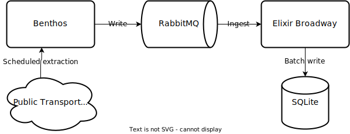

# Stream Transport

Small system that collects public GPS data from [Wrocław's public transport website](https://mpk.wroc.pl/strefa-pasazera/zaplanuj-podroz/mapa-pozycji-pojazdow). Used technologies used outlined below:



## Running instructions

```
# Create DB
mix ecto.create
mix ecto.migrate

# Build docker image
docker build -t stream_transport .

# RUN
docker-compose up
```
